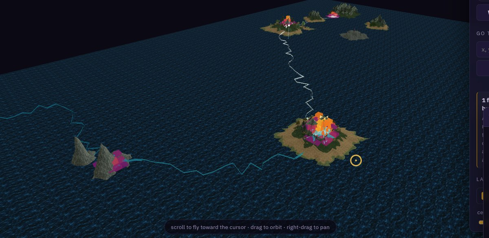
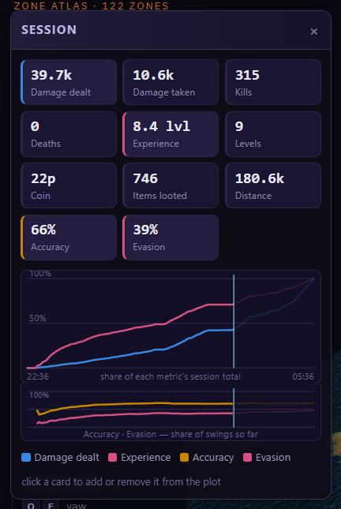
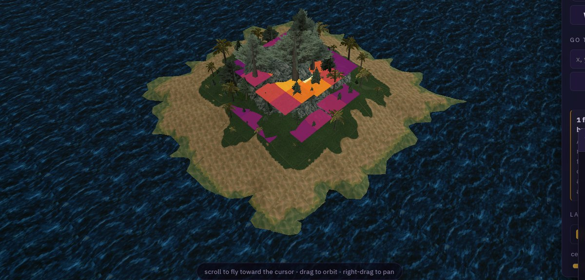
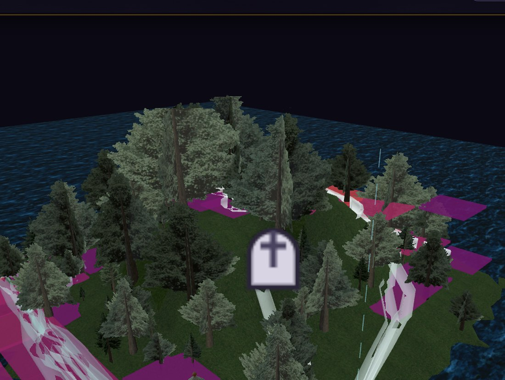

# EQ Trail

An overlay for the [EQL Tools Zone Atlas](https://eqltools.com/atlas). Drop an EverQuest log file
on it and your `/loc` track plays back as an animated 3D trail over the real zone geometry, with a
heatmap of where the time actually went.

**→ [Install page](https://kevroy314.github.io/eqatlas-overlay/)** (two minutes, Tampermonkey) ·
**[Wiki & FAQ](https://kevroy314.github.io/eqatlas-overlay/wiki/)**



It is an **extension of the Atlas, not a copy of it.** Nothing is re-hosted, no map data is
mirrored, and the log file never leaves the browser — the whole thing is one script that runs on
the page you already have open.

---

## Install (one time)

### Userscript — recommended, works in Chrome, Edge and Firefox

1. Install **Tampermonkey** from your browser's official extension store.
2. Click **[Install EQ Trail](https://kevroy314.github.io/eqatlas-overlay/eqtrail.user.js)**.
   Tampermonkey shows an install page → click **Install**.
3. Go to <https://eqltools.com/atlas>, pick a zone. A **Trail** panel appears bottom-right.

It carries `@updateURL`, so later versions install themselves.

### Browser extension — if you'd rather not use Tampermonkey

[`eqtrail-extension.zip`](https://kevroy314.github.io/eqatlas-overlay/eqtrail-extension.zip) is a
Manifest V3 extension. In Chrome or Edge: `chrome://extensions` → enable **Developer mode** →
**Load unpacked** → select the unzipped folder. Firefox needs a signed add-on for a permanent
install, so on Firefox prefer the userscript.

### No install at all

Paste `eqtrail-overlay.js` into the browser console on an already-loaded Atlas page. Same overlay —
the two bundles above are just this file plus a "wait for the page to be ready" wrapper.

---

## Using it

Drop `eqlog_<Character>_<server>.txt` onto the panel (or click it to browse). The panel then gives you:

| Control | What it does |
|---|---|
| **▶ / scrub** | play, pause, or drag to any moment in the session |
| **speed** | log-seconds per real second |
| **trail** | how much track stays lit behind the moving head |
| **ghost** | opacity of the route not yet walked (0 hides it) |
| **colour** | tint the trail by **time** (when) or **speed** (how fast) |
| **zone** | every zone found in the log, biggest first — pick one and it loads that map |
| **cell** | heatmap bin size |
| **relief** | `flat` paints the floor; higher extrudes the heat into a 3D relief |
| **weight** | **time** = seconds spent per cell · **visits** = number of `/loc` samples |
| **layers** | show/hide the path, the heat, and the death markers independently |
| **gaps** | how to treat long silences: `skip` · `fast fwd` · `real` |
| **over** | how long a silence has to be before it counts as a gap |
| **speed-up** | the fast-forward divisor (only shown in `fast fwd`) |
| **applies to** | whether the gap policy touches `both` layers, just the `path`, or just the `heat` |
| **stats** | show or hide the Session panel |
| **swap X/Y** | flip the `/loc` column order, for a client that prints north first |
| **hide** | `trail UI` hides our panels · `all UI` also hides the site's chrome for recording |

The colour bar under the heat controls is labelled in real units — minutes and seconds per cell, or
sample counts in `visits` mode.

Both panels **drag by their title bar**, and every setting — including where you parked them — is
saved to `localStorage` as you change it. Nothing from the log is ever stored; it stays in the tab
you dropped it into.

## Versions and feedback

The bottom of the panel carries a version row: which build you are on, a link when a newer one
exists, a **versions** list for rolling back, and **issue** / **idea** buttons that open a
pre-filled GitHub issue.

- The version check is **the only network request this tool makes** — one static JSON file from the
  project's own Pages, cached for a day, carrying nothing about you. The `updates` button turns it
  off and the overlay is entirely offline again.
- Rollback targets are **pinned** builds with no `@updateURL`, so a downgrade sticks. Without that,
  Tampermonkey would see the newer release at the other end and pull the user straight back to the
  version they were escaping.
- Issue reports include version, browser, GPU, loaded zone and counts. They include **no part of the
  log** — not its contents, not its file name (which carries the character name), not coordinates,
  not session times. Nothing is sent until the reader presses submit on GitHub, and the whole body is
  visible and editable first.

`tools/build.py` writes a pinned copy of each release into `docs/v/<version>/` and appends to
`docs/versions.json`; `tools/backfill_pinned.py` generated the historical ones from git tags.

**Hotkeys.** `H` hides and restores the Trail panels; `Shift`+`H` also hides the site's own header,
footer and controls so the map fills the window for a screen capture. Neither is remembered across a
reload, and while anything is hidden a small reminder of the key sits in the corner — it fades out so
it stays out of a recording, and any mouse movement brings it back.

## The Session panel



Eleven cards, counted from the log and animated in step with playback: **damage dealt**, **damage
taken**, **kills**, **deaths**, **experience**, **levels**, **coin**, **items looted**,
**distance travelled** — the last derived from the `/loc` track itself rather than from a log line,
which is why it agrees with the map — plus **accuracy** and **evasion**, the share of swings that
landed, going out and coming in.

Click any card to add or remove it from the plot below. The curves are cumulative and are revealed
as the playhead advances, with the not-yet-reached part drawn faint. With one series selected the
axis is that metric's own units; with several, each is drawn as a share of **its own** session total
and the axis says so — a second y-axis would be the wrong answer to "50,000 damage next to 6 deaths".

**Accuracy and evasion get their own band** beneath the chart rather than a second y-axis. Two
scales side by side make every crossing point read as a relationship when it is really an artifact
of the ranges chosen; percentages already share a natural 0–100% axis, so the ratios share one axis
with each other and none with the cumulative curves. The band appears only when a ratio is selected.

The chart is hand-rolled SVG, not a charting library: the extension build is Manifest V3, which
forbids remote code, and bundling one would cost more bytes than the entire overlay.





A **gravestone** marks each death, appearing as playback reaches it. Its position comes from the
`/loc` track at that timestamp: close samples are interpolated, distant ones are not — the stone
stays on the last known sample rather than inventing a spot halfway to wherever you went next, and
if the nearest sample is further off than `gapBreak` no stone is placed and the panel says how many
were unplaceable. A confident marker in the wrong place is worse than no marker.

---

## What your log needs

The only line that carries a position is the one `/loc` prints:

```
[Mon Jul 27 20:14:06 2026] Your Location is 8277.13, -2583.59, 126.62
```

Those three numbers are **east, north, up** — X first. This contradicts the usual folklore (and the
atlas's own source comment), so it was settled by measurement rather than argument: group every
`/loc` by the zone it was logged in, and check which assignment lands inside that zone's published
bounds. Across two logs from two different clients — EQ Legends and P1999 Green — "east first" fits
every zone with samples (8/8 and 8/8) while "north first" falls outside the map in 5 of 8 and 3 of 8.
`opts.swapXY`, or the **swap X/Y** button, flips it for any client that really does print north first.

`You have entered <Zone>.` lines are used to split a session by zone and pick the right map.

**You do not need to log time separately.** Every line EQ writes is already timestamped, and that
bracket *is* the time series. The macro only has to emit `/loc`.

**Drop the whole log — size is not a problem.** Logs are read in 4 MiB slices with a cheap
`indexOf` filter ahead of the regex, so nothing large is ever held in memory at once. Measured on
two real files: 121 MB / 1.57 M lines and 79 MB / 1.0 M lines, each parsed in **under three
seconds**, with a progress readout while it works.

**A log spanning many zones is normal, and handled.** One of those real files had 239 `/loc`s
scattered over 17 zones. Each zone's visits are merged into one series (37 separate visits to the
Emerald Jungle are useless as 37 three-point stubs), the panel lists them by sample count, and the
overlay defaults to **the zone already open on the page** if the log has any samples there — you
are never yanked to a different map. Zones the atlas doesn't carry are labelled `no map` and drawn
on whatever zone you have open.

Two things worth knowing before you trust the heatmap:

- **Timestamps are whole seconds.** Several `/loc`s inside one second arrive with identical stamps;
  the parser spreads a same-second run evenly across that second so playback doesn't stutter. It
  invents no positions — it only distributes samples already known to fall in that second.

- **A `/loc` bound to movement measures traffic, not dwell.** If the macro only fires while you're
  moving, standing still emits nothing, so "time per cell" credits a whole camp to the last sample
  before you stopped. Use **weight: visits** for that kind of log — it counts samples and is honest
  about it. A `/loc` on a fixed interval (every few seconds regardless of movement) makes the two
  readings agree, and **time** is then the better one. Either way no single gap can dominate: a
  sample may claim at most `opts.maxGap` seconds (30 by default), so one AFK stretch can't eat the
  colour range.

- **The ribbon breaks where the log went quiet.** Consecutive samples more than `opts.gapBreak`
  seconds apart (300 by default) start a new run rather than joining. Without it, two `/loc`s from
  different days — or from either side of a camp — would be drawn as a confident straight line
  across the zone. Note this is a *drawing* rule and is separate from the gap **time** policy below;
  one decides where the ribbon is cut, the other decides how long the playhead lingers.

## Long gaps

A `/loc` stream is not continuous. The macro stops, you camp a spawn, you go and make a coffee. On a
real seven-hour session that came to **58 gaps over a minute long, totalling 1h50 — 26% of the
session** spent, on playback, watching a stationary dot.

The **gaps** section controls it:

| Mode | Effect |
|---|---|
| `skip` | Discard the excess beyond the threshold. The default. |
| `fast fwd` | Divide the excess by the speed-up factor (10× by default). |
| `real` | A gap is time like any other. The pre-0.6 behaviour. |

Playback runs on a **presentation clock**, related to the log clock by a piecewise-linear map:
ordinary intervals map 1:1, gaps map through the policy. Everything downstream — the trail shader,
the gravestones, the Session stats — still works in real log time; only the *pacing* changes. The
scrubber follows the presentation clock too, so dragging it gives even attention to the parts where
something actually happens.

**`skip` deliberately means something different per layer.** In the animation the gap is *jumped* —
there is nothing to watch. On the heatmap the interval is *capped* at the threshold rather than
zeroed, because zeroing it would erase a camp from the map, and a camp is precisely what the heatmap
is for. Same rule, different baseline. **applies to** exists for that tension: set it to `heat` and
the animation timeline is untouched; set it to `path` and the heat weights are.

---

## Synthetic test data

`data/` holds two generated logs in the exact format above, so the overlay can be exercised without
a real character:

- `eqlog_Testchar_legends.txt` — 918 `/loc`s over 46 minutes in the Ocean of Tears: island camps
  with real dwell, travel legs between them.
- `eqlog_Twozone_legends.txt` — the same session zoning into Butcherblock Mountains, including
  deliberate same-second bursts, to exercise segmentation and sub-second spreading.

`tools/gen_log.py` regenerates the first. It raycasts the actual zone mesh (`tools/oot_grid.json`,
a height grid sampled from the live Atlas) so the synthetic track lands on real ground and real
island tops rather than floating.

---

## How it attaches

`atlas/app.js` is an ES module — nothing of its own is global — but it publishes a debug handle at
the end:

```js
window.__dbg = { get Z(), scene, THREE, locToMesh, meshToLoc, loadZone, cam(), ctl(), ... }
```

That is the entire integration surface. We add objects; we never patch their code. Two rules make
the overlay behave like a native layer, and three details will silently defeat you if you miss them
— all of it is commented at the point it matters in `eqtrail-overlay.js`:

- **Coordinates.** `mesh.x = -east/10`, `mesh.y = up/10`, `mesh.z = north/10`. Use their
  `locToMesh`; it is the source of truth for every coordinate the page shows.
- **Parenting.** In the exploded view each floor band group is lifted (`Z.groups[i].position.y`).
  Overlay objects are parented into the band their height falls in, so they ride the lift, the
  height slider and the per-floor visibility for free — the same trick `placeMarker` uses.
- **`logarithmicDepthBuffer: true`.** Their renderer uses it. A custom shader that omits three's
  `logdepthbuf_*` chunks writes ordinary depth into a log-depth buffer, loses the depth test
  against the ground, and is invisible everywhere **with no error in the console**.
- **`Z.clip` is per band.** `Z.clip[i]` is that band's `[yMin, yMax]` plane pair. Handing a material
  the whole nested array clips everything away.
- **Never give an element a class name the host page also uses.** Ours was `.hint`; the Atlas has
  its own `.hint` — the floating pill under the 3D view. Our element silently inherited
  `position:absolute`, `border-radius:999px` and `pointer-events:none` from it and became a
  detached, wildly-rounded bubble that floated over the panel and let clicks fall *through* to the
  file-drop zone behind it. Scoping our own selector does not help: the host's rule is what matches
  our element, so the class **name** has to be ours alone. Every class this overlay adds is
  prefixed `eqt-`.
- **A backtick inside the CSS template literals truncates the stylesheet silently.** With an even
  number of them the file still parses — `node --check` sees nothing wrong — while everything after
  the first one stops being CSS. `tools/build.py` refuses to build if it finds one.
- **`InstancedMesh` colours take no `vertexColors` flag.** `setColorAt` populates `instanceColor`
  and three defines `USE_INSTANCING_COLOR` itself. Adding `vertexColors: true` also defines
  `USE_COLOR`, the shader then reads a per-vertex `color` attribute a `BoxGeometry` doesn't have,
  and every cell renders pure black.

## Why an overlay rather than a hosted app

`/atlas/zones/*.json` and `*.glb` return **403 unless the request carries
`Sec-Fetch-Site: same-origin`** — a header a browser can never send cross-origin and only a server
can forge. That is a deliberate hotlink guard, so the zone geometry is not ours to re-serve. Running
on their page instead costs them one ordinary page view and keeps the maps exactly as published.

Map data and geometry are © eqltools.com — see <https://eqltools.com/sources>.

---

## Files

```
eqtrail-overlay.js        the overlay — the only hand-written source. Paste it into a
                          console as-is, or let tools/build.py wrap it for distribution.
tools/build.py            -> docs/eqtrail.user.js, docs/extension/, docs/eqtrail-extension.zip
tools/gen_log.py          regenerates the synthetic Ocean of Tears session
tools/oot_grid.json       ground-height grid raycast from the live Atlas
data/                     synthetic logs
docs/                     the GitHub Pages site: install page, built bundles, screenshots
```

`docs/` is both the published install page and the build output — GitHub Pages serves that folder,
and Tampermonkey installs from any URL ending in `.user.js`. **Everything under `docs/` except
`index.html` and the images is generated: edit `eqtrail-overlay.js`, then re-run
`python3 tools/build.py`.**
